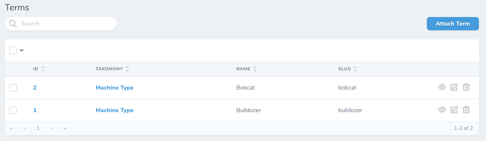

# Introduction

This package provides a field that displays related models as a comma-separated, linked list, rather than a full table of related models.

By default, it’s displayed only on the index and detail views.

# Installation and Usage

1. Run `composer require brilliant-packages/nova-relationships-link-list`
2. Add a `RelationshipsLinkList` field to your Nova resource:

```php
use BrilliantPackages\NovaRelationshipsLinkList\RelationshipsLinkList;

    public function fields(Request $request)
    {
        return [
            // Other fields

            RelationshipsLinkList::make('Terms'),

            // Other fields
        ];
    }
```

# Screenshots

## Before



## After


