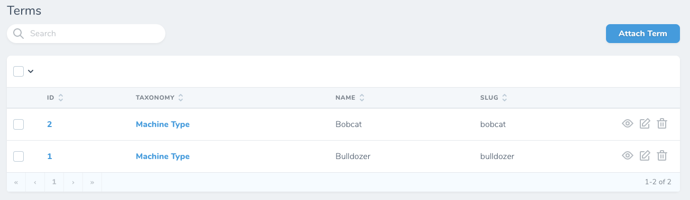
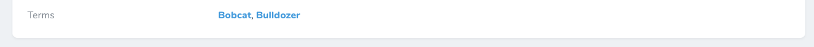

# Nova Relationships Link List

This package provides a field that displays related models as a comma-separated, linked list, rather than a full table of related models.

By default, it’s displayed only on the index and detail views.

# Installation and Usage

See [documentation](documentation/README.md).

# Screenshots

## Before

## After

